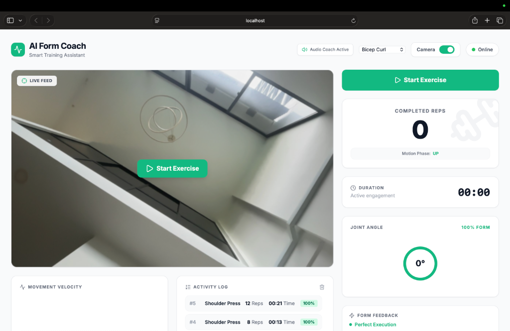
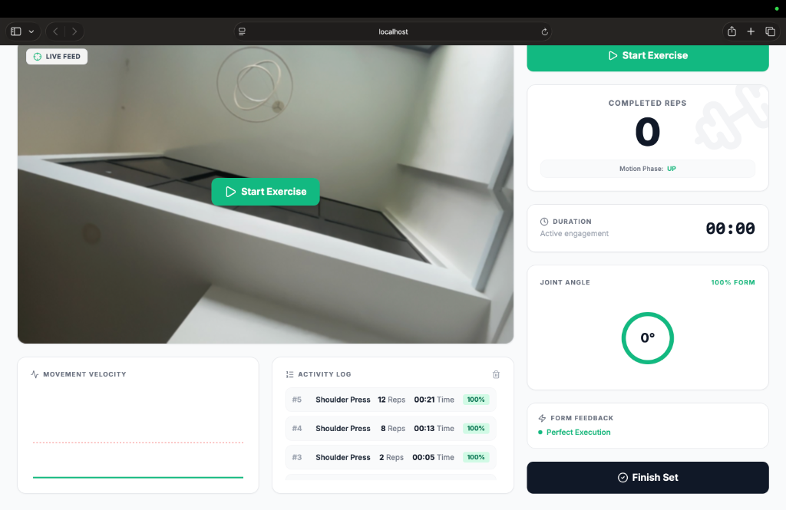

# AI Form Coach

## 📝 Project Overview

AI Form Coach is an AI-powered fitness coaching application that provides real-time exercise tracking and posture analysis using computer vision. The application analyzes body movements through a webcam, counts repetitions, evaluates exercise form, and provides instant feedback to help users perform workouts correctly.

This project was developed as a third-year Computer Science portfolio project at Taylor's University to strengthen my skills in full-stack web development, artificial intelligence, computer vision, and real-time communication.

**Project Status:** Functional Prototype

---

## 🚀 Features

- Real-time exercise tracking using computer vision
- AI-powered posture and form analysis
- Automatic repetition counting
- Live feedback during workouts
- Supports exercises such as:
  - Bicep Curls
  - Squats
  - Shoulder Press
- Performance dashboard with workout statistics
- Text-to-Speech voice feedback
- Real-time communication using WebSockets
- Session data stored locally using SQLite

---

## 🛠️ Tech Stack

### Frontend
- React 19
- Vite
- Tailwind CSS
- Recharts
- Lucide React

### Backend
- Python
- FastAPI
- Uvicorn

### AI & Computer Vision
- OpenCV
- MediaPipe

### Database
- SQLite

### Communication
- WebSockets

---

## 📂 Project Structure

```text
Apex-Vision/
│
├── frontend/
│   ├── src/
│   ├── public/
│   └── package.json
│
├── backend/
│   ├── app.py
│   ├── requirements.txt
│   ├── sessions.db
│   └── ...
│
└── README.md
```

---

## 💻 Getting Started

### 1. Clone the repository

```bash
git clone https://github.com/haadizargarr/Apex-Vision.git
cd Apex-Vision
```

### 2. Start the backend

```bash
cd backend
python3 -m venv venv
source venv/bin/activate
pip install -r requirements.txt
python app.py
```

### 3. Start the frontend

```bash
cd frontend
npm install
npm run dev
```

The frontend will run on:
```text
http://localhost:5173
```

The backend will run on:
```text
http://localhost:8000
```

---

## 📸 Screenshots

### AI Fitness Coach Dashboard



---

### Dashboard Analytics and Feedback Details



---

## 🎯 Learning Outcomes

Through this project, I gained experience with:

- Building full-stack web applications
- Developing REST APIs using FastAPI
- Real-time communication using WebSockets
- Computer vision with OpenCV and MediaPipe
- AI-assisted posture detection
- React component development
- Data visualization using Recharts
- Managing application state and backend integration

---

## 🔮 Future Improvements

- User authentication
- Workout history and progress tracking
- Additional exercise support
- Personalized AI workout recommendations
- Cloud database integration
- Mobile application version

---

## 👨‍💻 Author

**Haadi Zargar**  
Third-Year Computer Science Student  
Taylor's University
